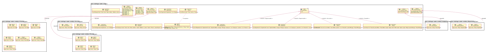
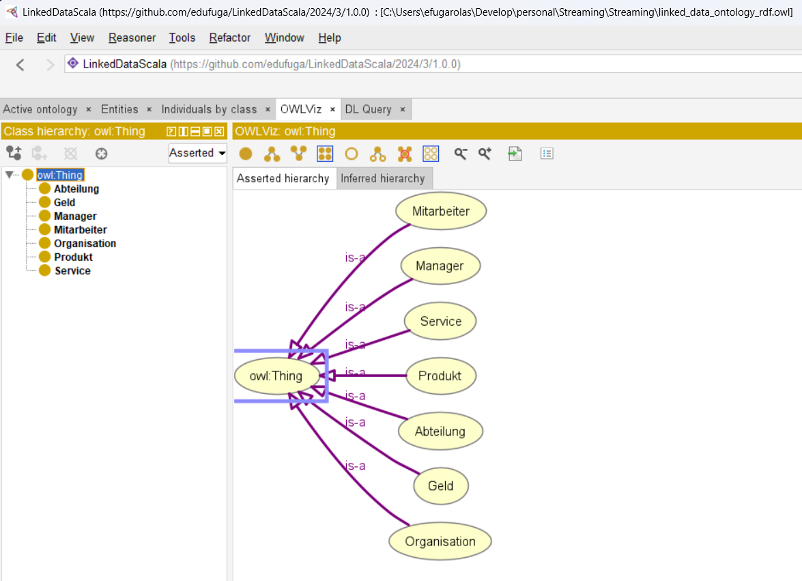
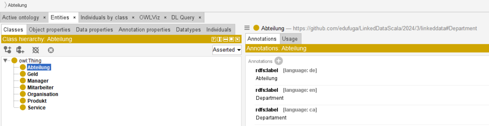

# Ontology Description

This document is a high-level description of the **ontology** used in this Scala-based project.

## Approach: Domain-specific and code-first

The chosen and organically developed approach to this project is, first and foremost, a _domain-**specific**_ one.
This means that instead of developing the ontology _first_, starting from scratch, I have represented the data in
**code**, using [Scala](https://www.scala-lang.org/) as the strongly and statically typed programming language choice.
More (technical) details about this technical aspect are found in the [README.md](README.md).

Another implication of the domain-specific approach, is that it's **model-driven**. The first steps were to _model_ the
entities by abstracting the initial set of data (CSV and XML files, which are _details_). This view, approach and
methodology fits well with the established discipline of software engineering. In such a view, the concepts and
technologies of the Semantic Web and Linked Data world are _technical details_. This is formulated in and expressed by
the wording "semantic technology".

The alternative approach of domain-agnostic and/or data-centric application development was also considered.
The purpose of this document and my implementation of the project is **not** to disregard this possibility as a bad or
lesser choice. Both (and other) approaches are fitting and worth considering, depending on several factors and
considerations. As always in the software world, everything has trade-offs and a cultural and skill-based embedding.
One of the reasons for choosing such a model-driven approach, was simply to experiment with the idea and implementation.

After modelling the concepts of the project in code, I went on to developing the ontology. The rest of the document is
centered around this: the ontology and its development.

### Description of the underlying model

The model, which was based on and abstracted from the data files, can be found in the
[entities](entities%2Fsrc%2Fmain%2Fscala%2Fcom%2Fedufuga%2Fscala%2Fentities) folder. The Scala code should be quite
readable and understandable. A (arguably less understandable) visual representation in a UML diagram looks like this:

(Hint: https://raw.githubusercontent.com/edufuga/LinkedDataScala/main/LinkedDataUML.svg looks nicer when viewing)

This UML diagram was generated with [`scala-uml`](https://github.com/tizuck/scala-uml). Other alternative tools exist.
The UML diagram is mentioned here only as a possible visualization of the model. I still think the code is nicer, but
I'm obviously biased.

One thing to notice is that the code is not only strongly and statically typed (by using Scala), but also uses very
_explicit_ types. This is also known as "tiny types": Instead of using primitive (in a conceptual sense) types such as
Strings, Integers, etc., we declare the types of the fields (attributes, members, properties) very explicitly with an
own type.

This is fine in the _code_, but the question of whether the _ontology_ should be so explicit can and should be posed as
well. My current approach is to make the ontology conceptually closer to the data, by using primitive types such as
strings and numbers (integer, double, float, etc.). This may or may not change, once the ontology is used as a part of
the semantic technology driving the code implementation. It's also open for discussion.

## Tooling: Protégé as a graphical Ontology Editor

The ontology is written using the [Web Ontology Language (OWL)](https://en.wikipedia.org/wiki/Web_Ontology_Language).
More specifically, it was developed using the desktop application [Protégé](https://protege.stanford.edu/), an ontology
editor. The result was serialized using Protégé's own [OWL API](https://github.com/owlcs/owlapi) to a format such as
RDF/Turtle or OWL/XML. Both files are found in the repository:

* OWL2 XML Syntax: [linked_data_ontology_rdf.owl](linked_data_ontology_rdf.owl)
* RDF/Turtle: [linked_data_ontology_rdf.ttl](linked_data_ontology_rdf.ttl)

These files can be opened with Protégé to visualize, discuss, review and evolve the ontology.

### Visualization: OWLViz as a Protégé plugin

The ontology can be visualized inside Protégé after installing the [OWLViz](https://github.com/protegeproject/owlviz)
plugin and enabling it (Window > Tabs > OWLViz). The outcome looks like the following screenshot:

### Localization
Notice the German names due to the localization with `rdfs:label` annotation. These differ from the (English) IRI.

Strangely enough, the alphabetically first language (Catalan) is not shown in the GUI of Protégé.

# References

## Rationale
This section contains a compact selections of some of the resources and references which were useful in developing the
ontology and gaining (more) knowledge about ontologies. Furthermore, the techniques and methodologies for ontology
engineering also needed to be considered.

Concretely, the topic of how to match the domain of software engineering with the semantic technology was (and still is)
a recurring theme behind this project and my approach to it.

## Protégé

* https://protege.stanford.edu/
* http://protegeproject.github.io/protege/getting-started/
* http://protegeproject.github.io/protege/views/class-description/
* http://protegeproject.github.io/protege/class-expression-syntax/
* https://protegewiki.stanford.edu/wiki/ProtegeOWL_API_Programmers_Guide
* https://www.dbis.informatik.uni-goettingen.de/Teaching/SWPr-SS19/owlapi.pdf
* https://github.com/protegeproject/owlviz

## OWL

* https://www.w3.org/TR/2004/REC-owl-guide-20040210/
* https://www.w3.org/TR/2012/REC-owl2-quick-reference-20121211/
* https://www.w3.org/2007/OWL/refcardA4

## OpenHPI [course](https://open.hpi.de/courses/knowledgegraphs2023) on Knowledge Graphs

* Week 4: _Ontologies as Key to Knowledge Representation_
* Week 5: _Ontological Engineering for Smarter Knowledge Graphs_

## Semantic VS programmatic (object-oriented) points of view

* https://www.w3.org/TR/sw-oosd-primer/

## Model-driven approach to ontology-based application development

* https://ceur-ws.org/Vol-2063/sisiot-paper4.pdf

The last two categories will be expanded upon in a follow-up document, when engineering the software of the project
around the semantic technology.
