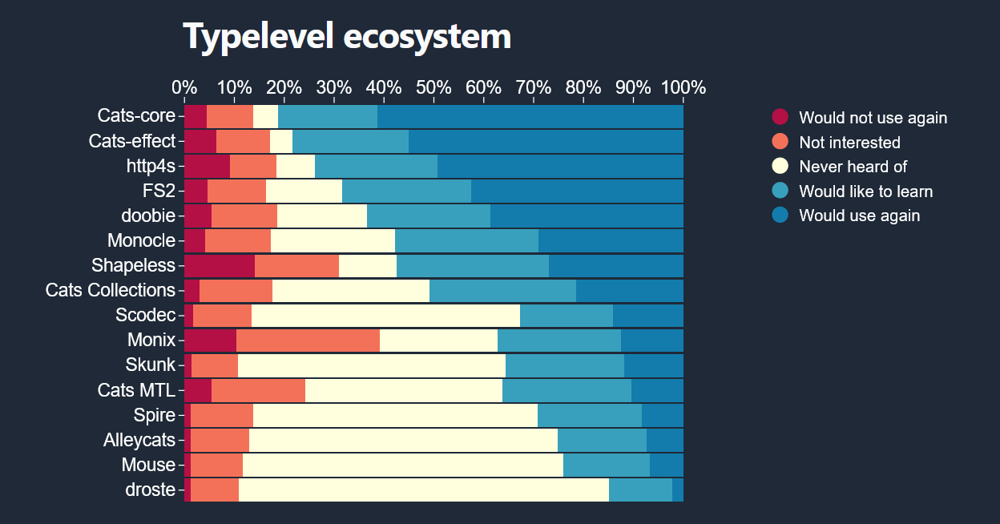

# Linked Data with Scala

This is an **example project** showcasing the use of Scala as a statically typed programming language for implementing a
Linked Data project.

## Setup for the project
In order to build the source code, you'll need the right setup for the JVM, Scala and the Scala Build Tool (sbt).

Under Linux and macOS, we recommend using [SDKMAN!](https://sdkman.io/).
Under Windows, you may use [Coursier](https://get-coursier.io/docs/cli-setup).

The project was built with **Java 21**, **Scala 3.3.1** and **Sbt 1.9.8**. The Scala version is also indicated in the
`build.sbt` file.

Using SDKMAN!, you can instantiate the right environment **in the running shell**, using the following commands:
```bash
sdk use java 21.0.2-tem
sdk use scala 3.3.1
sdk use sbt 1.9.8
```
These commands assume that you have _installed_ those packages previously. If not, just change `use` for `install`.

## Building the project
This project uses the [sbt native packager](https://sbt-native-packager.readthedocs.io/en/latest/) plugin for creating a
_native package_. Building the program and executing it are two unrelated tasks.

1. For building the source code: `sbt stage`.
2. For executing the native package (e.g. under Unix):
   `./target/universal/stage/bin/main src/main/resources/products.csv src/main/resources/services.csv src/main/resources/orgmap.xml organisation.rdf` 

## Running the project
For development purposes, there is yet another option to compile and execute the program, i.e. to 'run' it. Both happen
using only one command.

To run the main program, execute the following command directly from the root directory of the project:
```sh
sbt "run src\main\resources\products.csv src\main\resources\services.csv src\main\resources\orgmap.xml src\main\resources\organisation.rdf"
```

Under Unix, run:
```shell
sbt "run src/main/resources/products.csv src/main/resources/services.csv src/main/resources/orgmap.xml src/main/resources/organisation.rdf"
```
Alternatively, run the `run` scripts in the root directory.

## Knowledge Graph: Importing and Persisting
The main goal of the Linked Data project is to **import** three different files (two CSV files and one XML file) and to
**transform** this data into a **knowledge graph**. The basis for such a knowledge graph is an **ontology** for
representing the content of the source files. The technologies and semantic languages to be used are RDF(S) and
OWL.

## Scala as a functional programming language with a strong ecosystem

This example project is the perfect opportunity to showcase not only the Linked Data **domain** and its technologies,
but also one of the popular usages of [Scala](https://www.scala-lang.org/) as a **backend programming language**.
More specifically, we'll use the **Typelevel stack** for processing the files in a purely functional (i.e. effectful)
fashion.

### TypeLevel stack

Our focus will be on the following technologies:

* [Cats](https://typelevel.org/cats/): Functional Programming in Scala
* [Cats Effect](https://typelevel.org/cats-effect/): A pure asynchronous runtime for Scala
* [fs2](https://fs2.io/): Functional Streams for Scala
* [fs2-data](https://fs2-data.gnieh.org/): Parsing and transforming data in a streaming manner (CSV, XML, JSON)

For more context and details on this and other technologies and the Scala ecosystem, see the (as of this writing) last
[Scala Survey Results](https://scalasurvey2023.virtuslab.com/).



### Technical assistance

For an introduction to fs2, read https://blog.rockthejvm.com/fs2/ and/or watch the two videos from
[RockTheJVM](https://rockthejvm.com/) under https://www.youtube.com/watch?v=XCpGtaJjkVY and
https://www.youtube.com/watch?v=W0jh2sO-TZ8. These videos are highly recommended for a first introduction to fs2.

A similar example of processing a CSV file via streaming can be found at
https://gist.github.com/gvolpe/40b1f38ebbcbb76266dc40cad587c469 from Gabriel Volpe.

The RegEx "magic" can be better understood with
https://jenisys.github.io/behave.example/step_matcher/regular_expressions.html,
https://docs.scala-lang.org/tour/regular-expression-patterns.html and
https://alvinalexander.com/scala/how-to-extract-parts-strings-match-regular-expression-regex-scala/.

